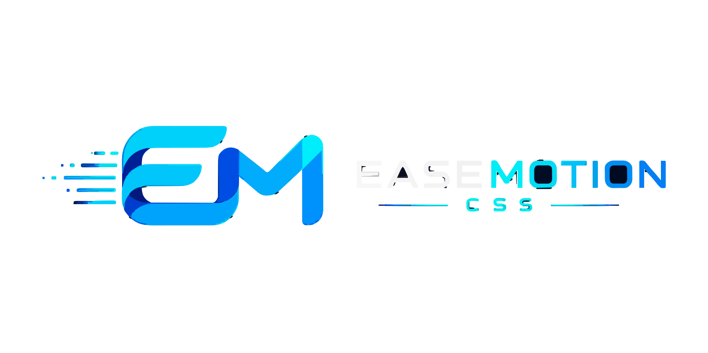

<div align="center">



<br/>

# ⚡ EaseMotion CSS

**এক্সপ্রেসিভ UI মোশনের জন্য আধুনিক অ্যানিমেশন ফ্রেমওয়ার্ক।**

UI লেখো যেভাবে ইংরেজিতে বলো। কোনো বিল্ড স্টেপ নেই। শর্টহ্যান্ড মুখস্থ করতে হবে না। শুধু একটা ফাইল লিঙ্ক করো আর শিপ করো।

<br/>

[](https://www.npmjs.com/package/easemotion-css)
[](https://www.npmjs.com/package/easemotion-css)
[](https://www.jsdelivr.com/package/npm/easemotion-css)
[](https://github.com/SAPTARSHI-coder/EaseMotion-css/stargazers)
[](https://github.com/SAPTARSHI-coder/EaseMotion-css/network/members)
[](https://github.com/SAPTARSHI-coder/EaseMotion-css/graphs/contributors)
[](https://github.com/SAPTARSHI-coder/EaseMotion-css/pulls?q=is%3Apr+is%3Amerged)
[](https://github.com/SAPTARSHI-coder/EaseMotion-css/issues?q=is%3Aissue+is%3Aclosed)
[](https://github.com/SAPTARSHI-coder/EaseMotion-css/pulls)
[](https://github.com/SAPTARSHI-coder/EaseMotion-css/issues)
[](./LICENSE)
[](https://gssoc.girlscript.tech/)
[](https://github.com/SAPTARSHI-coder)

<br/>

---

### 🚀 মাত্র একটি লাইন। এটুকুই দরকার।

```html
<link rel="stylesheet" href="https://cdn.jsdelivr.net/gh/SAPTARSHI-coder/EaseMotion-css@main/easemotion.min.css" />
```

**[📖 ডকুমেন্টেশন](https://saptarshi-coder.github.io/EaseMotion-css/) · [🎮 লাইভ ডেমো](https://github.com/SAPTARSHI-coder/EaseMotion-css/blob/main/examples/demo.html) · [📦 npm](https://www.npmjs.com/package/easemotion-css) · [🤝 অবদান রাখুন](./CONTRIBUTING.md)**

</div>

---

## ⭐ প্রজেক্টটিকে সাপোর্ট করুন

EaseMotion CSS যদি তোমার সময় বাঁচায় বা শেখার পথে সাহায্য করে, তাহলে সাপোর্ট করার কথা ভাবো।

বেশিরভাগ মানুষ ভুলে যায়। এটা তোমার মনে করিয়ে দেওয়া। 😊

<div align="center">

| কাজ | কেন গুরুত্বপূর্ণ |
|--------|----------------|
| [⭐ **রেপো স্টার করো**](https://github.com/SAPTARSHI-coder/EaseMotion-css/stargazers) | আরও ডেভেলপারদের কাছে প্রজেক্টটি পৌঁছাতে সাহায্য করে |
| [🍴 **ফর্ক করো ও অবদান রাখো**](./CONTRIBUTING.md) | তোমার আইডিয়া একটা আসল ফ্রেমওয়ার্ক ক্লাস হয়ে উঠতে পারে |
| [🐞 **ইস্যু রিপোর্ট করো**](https://github.com/SAPTARSHI-coder/EaseMotion-css/issues/new?template=bug_report.md) | তুমি যে বাগ ধরো সেটা সবার জন্য উপকারী |
| [💡 **ফিচার সাজেস্ট করো**](https://github.com/SAPTARSHI-coder/EaseMotion-css/issues/new?template=feature_request.md) | ভালো আইডিয়া ভাবার চেয়ে দ্রুত শিপ হয় |

</div>

> স্টার করতে কিছু খরচ হয় না, কিন্তু একটি স্বাধীন ওপেন-সোর্স প্রজেক্টের জন্য এর মানে অনেক। যদি এটা তোমার মাত্র ১০ মিনিটও বাঁচিয়ে থাকে, তাহলে একটা ক্লিক করার যোগ্য।

---

## 📊 প্রজেক্ট পরিসংখ্যান

<div align="center">

| মেট্রিক | মান |
|--------|-------|
| 📦 **npm প্যাকেজ** | [`easemotion-css`](https://www.npmjs.com/package/easemotion-css) |
| 🌐 **CDN** | [cdn.jsdelivr.net/gh/...](https://cdn.jsdelivr.net/gh/SAPTARSHI-coder/EaseMotion-css@main/easemotion.min.css) |
| ⚡ **ক্লাস** | ৮০+ ইউটিলিটি ক্লাস, ২০+ অ্যানিমেশন ক্লাস |
| 🎨 **কম্পোনেন্ট** | বাটন (৬ ভেরিয়েন্ট), কার্ড (১২ ভেরিয়েন্ট) |
| 🔑 **ডিজাইন টোকেন** | ৬০+ CSS কাস্টম প্রপার্টি |
| ⚖️ **বান্ডেল সাইজ** | ~১৫ kB (আনপ্যাকড: ~৬২ kB) |
| 📜 **লাইসেন্স** | MIT |
| 🔧 **বিল্ড স্টেপ** | ❌ প্রয়োজন নেই |
| 🏗️ **নির্ভরতা** | ❌ শূন্য |

</div>

---

## ✨ EaseMotion CSS কী?

EaseMotion CSS হলো একটি কিউরেটেড, অ্যানিমেশন-প্রথম CSS ফ্রেমওয়ার্ক যেখানে **ক্লাসের নামগুলো সহজ ইংরেজিতে পড়া যায়**। শর্টহ্যান্ড মুখস্থ করতে হয় না। বিল্ড স্টেপ নেই। কনফিগারেশন নেই। শুধু HTML লেখো আর কাজ করো।

```html
<!-- এটুকুই যথেষ্ট -->
<div class="ease-center ease-fade-in">
  <h1 class="ease-slide-up ease-delay-100">দ্রুত তৈরি করো।</h1>
  <p class="ease-slide-up ease-delay-200">মানুষের জন্য অ্যানিমেশন-প্রথম CSS।</p>
  <button class="ease-btn ease-btn-primary ease-btn-pill ease-hover-grow ease-delay-300">
    শুরু করো →
  </button>
</div>
```

> ⚡ পঠনযোগ্য CSS ক্লাস ব্যবহার করে সুন্দর অ্যানিমেটেড ইন্টারফেস তৈরি করো। কোনো বিল্ড স্টেপ নেই। কনফিগারেশন নেই। শুধু একটা ফাইল লিঙ্ক করো আর বিল্ড শুরু করো।

---

## 🆚 কেন EaseMotion CSS?

| | Vanilla CSS | Tailwind CSS | **EaseMotion CSS** |
|---|:---:|:---:|:---:|
| সেটআপ | স্ক্র্যাচ থেকে লেখো | বিল্ড স্টেপ + কনফিগ | **একটি ফাইল লিঙ্ক করো** |
| পাঠযোগ্যতা | ✅ বেশি | ❌ কম (`px-4 flex gap-x-2`) | ✅ **বেশি** (`ease-center`) |
| অ্যানিমেশন | ⚙️ ম্যানুয়াল | 🔸 সীমিত | ✅ **ফার্স্ট-ক্লাস** |
| জিরো কনফিগ | ✅ | ❌ | ✅ |
| কোয়ালিটি কন্ট্রোল | তুমি | তুমি | ✅ **মেইনটেইনার কিউরেটেড** |
| CDN রেডি | N/A | ❌ | ✅ **হ্যাঁ** |
| শেখার বাধা | বেশি | মাঝারি | ✅ **প্রায় শূন্য** |

---

## ⚡ দ্রুত শুরু

### অপশন ১ — CDN *(সবচেয়ে দ্রুত, জিরো সেটআপ, প্রস্তাবিত)*

```html
<!DOCTYPE html>
<html>
<head>
  <link rel="stylesheet" href="https://cdn.jsdelivr.net/gh/SAPTARSHI-coder/EaseMotion-css@main/easemotion.min.css" />
</head>
<body>
  <div class="ease-center ease-fade-in">
    <h1>হ্যালো, EaseMotion!</h1>
  </div>
</body>
</html>
```

> jsDelivr দ্বারা চালিত — গ্লোবালি ক্যাশড, সবসময় দ্রুত, কোনো অ্যাকাউন্ট লাগে না। CDN লিঙ্ক পেস্ট করার সাথে সাথেই লাইভ।

### অপশন ২ — npm

```bash
npm install easemotion-css
```

তারপর HTML-এ:

```html
<link rel="stylesheet" href="node_modules/easemotion-css/easemotion.css" />
```

অথবা CSS / PostCSS / Sass-এ:

```css
@import "easemotion-css/easemotion.css";
```

### অপশন ৩ — গ্রানুলার ইম্পোর্ট *(শুধু যা দরকার তা নাও)*

```html
<!-- Core (সবসময় প্রয়োজন — এই নির্দিষ্ট ক্রমে লোড করো) -->
<link rel="stylesheet" href="https://cdn.jsdelivr.net/npm/easemotion-css/core/variables.css" />
<link rel="stylesheet" href="https://cdn.jsdelivr.net/npm/easemotion-css/core/base.css" />
<link rel="stylesheet" href="https://cdn.jsdelivr.net/npm/easemotion-css/core/animations.css" />
<link rel="stylesheet" href="https://cdn.jsdelivr.net/npm/easemotion-css/core/utilities.css" />

<!-- কম্পোনেন্ট — শুধু যা ব্যবহার করো তা যোগ করো -->
<link rel="stylesheet" href="https://cdn.jsdelivr.net/npm/easemotion-css/components/buttons.css" />
<link rel="stylesheet" href="https://cdn.jsdelivr.net/npm/easemotion-css/components/cards.css" />
```

> ⚠️ **`variables.css` সবসময় আগে লোড করতে হবে।** অন্য সব মডিউল এর CSS কাস্টম প্রপার্টির উপর নির্ভরশীল।

---

## 🧠 দর্শন

EaseMotion CSS শুধু একটি CSS লাইব্রেরি নয় — এটি একটি ডিজাইন ভাষা।

> *"যদি ইংরেজিতে বলতে পারো, তাহলে ক্লাস হিসেবেও লিখতে পারা উচিত।"*

```html
<!-- এটাকে কেন্দ্র করো -->      <div class="ease-center">
<!-- এটাকে ফেড ইন করো -->       <h1 class="ease-fade-in">
<!-- হোভারে বড় করো -->         <button class="ease-hover-grow">
<!-- দেরিতে স্লাইড আপ করো --> <p class="ease-slide-up ease-delay-200">
```

ডকুমেন্টেশন দেখার দরকার নেই। ক্লাসের নামই **হলো** ডকুমেন্টেশন।

### চারটি নীতি যা কখনো ভাঙা হয় না

| নীতি | অর্থ |
|-----------|---------------|
| **মানুষের ভাষায়** | ক্লাসের নামগুলো সহজ ইংরেজিতে আচরণ বর্ণনা করে |
| **অ্যানিমেশন-প্রথম** | মোশন একটি ফার্স্ট-ক্লাস নাগরিক, পরের চিন্তা নয় |
| **কম্পোজেবল** | যেকোনো ক্লাস স্বাধীনভাবে স্ট্যাক করো — কোনো স্পেসিফিসিটি যুদ্ধ নেই |
| **কিউরেটেড** | প্রতিটি ক্লাস রিলিজের আগে মেইনটেইনার রিভিউ করেন |

### কিউরেশন পাইপলাইন কীভাবে কাজ করে

```
১. কন্ট্রিবিউটররা রো HTML + CSS জমা দেয়
         ↓
২. মেইনটেইনার রিভিউ করেন ও ফিট মূল্যায়ন করেন
         ↓
৩. কোড EaseMotion CSS ফরম্যাটে রূপান্তরিত হয়
   (ease-* নামকরণ · CSS ভেরিয়েবল · অ্যাক্সেসিবিলিটি)
         ↓
৪. core/ বা components/-এ ইন্টিগ্রেট হয়
         ↓
৫. রিলিজ, ডকুমেন্ট ও ক্রেডিট দেওয়া হয়
```

ফ্রেমওয়ার্কের প্রতিটি ক্লাস এই প্রক্রিয়ার মধ্য দিয়ে গেছে। এই কিউরেশনই EaseMotion CSS-কে সামঞ্জস্যপূর্ণ রাখে।

---

## 💡 ব্যবহার ও উদাহরণ

### অ্যানিমেশন

```html
<!-- প্রবেশ অ্যানিমেশন (পেজ লোডে চালু হয়) -->
<h1 class="ease-fade-in">ফেড ইন</h1>
<h2 class="ease-slide-up">স্লাইড আপ</h2>
<h3 class="ease-slide-in-left">বাম থেকে স্লাইড</h3>
<h4 class="ease-zoom-in">জুম ইন</h4>
<h5 class="ease-flip">3D ফ্লিপ</h5>

<!-- স্তরবিন্যাস — প্রতিটি আইটেম আগেরটার ১০০ms পরে -->
<div class="ease-slide-up ease-delay-100">প্রথম</div>
<div class="ease-slide-up ease-delay-200">দ্বিতীয়</div>
<div class="ease-slide-up ease-delay-300">তৃতীয়</div>

<!-- লুপিং অ্যানিমেশন -->
<div class="ease-bounce">বাউন্সিং</div>
<div class="ease-pulse">পালসিং</div>
<div class="ease-rotate">ঘুরছে</div>
<div class="ease-ping">পিং</div>

<!-- এক্সিট অ্যানিমেশন -->
<div class="ease-expand-border-exit"></div>
```

### হোভার ইফেক্ট

```html
<button class="ease-hover-grow">হোভারে বড় হয়</button>
<div    class="ease-hover-morph-card">মর্ফ</div>
<div    class="ease-hover-glow">প্রাইমারি কালার গ্লো</div>
<div    class="ease-hover-lift">শ্যাডোসহ উপরে ওঠে</div>
<div    class="ease-hover-shimmer">শিমার সুইপ ইফেক্ট</div>
<a      class="ease-hover-underline">অ্যানিমেটেড আন্ডারলাইন</a>
<span   class="ease-hover-bounce-text">বাউন্স!</span>
```

### লেআউট ইউটিলিটি

```html
<!-- সেন্টারিং (সবচেয়ে বেশি ব্যবহৃত ইউটিলিটি) -->
<div class="ease-center">পারফেক্টলি সেন্টারড</div>

<!-- ফ্লেক্সবক্স -->
<div class="ease-flex ease-justify-between ease-items-center ease-gap-4">
  <span>বাম</span>
  <span>ডান</span>
</div>

<!-- রেসপন্সিভ অটো-ফিট গ্রিড (মিডিয়া কোয়েরি ছাড়া) -->
<div class="ease-grid ease-grid-auto ease-gap-6">
  <div class="ease-card">কার্ড ১</div>
  <div class="ease-card">কার্ড ২</div>
  <div class="ease-card">কার্ড ৩</div>
</div>
```

### বাটন

```html
<!-- ভেরিয়েন্ট -->
<button class="ease-btn ease-btn-primary">প্রাইমারি</button>
<button class="ease-btn ease-btn-success">সাকসেস</button>
<button class="ease-btn ease-btn-danger">ডেঞ্জার</button>
<button class="ease-btn ease-btn-outline">আউটলাইন</button>
<button class="ease-btn ease-btn-ghost">ঘোস্ট</button>

<!-- হোভার অ্যানিমেশনসহ -->
<button class="ease-btn ease-btn-primary ease-btn-hover">অ্যানিমেটেড</button>

<!-- স্কুইশ বাটন -->
<button class="ease-btn ease-btn-primary ease-squish-button">স্কুইশ মি</button>

<!-- সাইজ + আকৃতি -->
<button class="ease-btn ease-btn-primary ease-btn-sm">ছোট</button>
<button class="ease-btn ease-btn-primary ease-btn-lg ease-btn-pill">বড় পিল</button>
```

### কার্ড

```html
<!-- শ্যাডোসহ হোভার কার্ড -->
<div class="ease-card ease-card-shadow ease-card-hover">
  <div class="ease-card-header">
    <h3 class="ease-card-title">শিরোনাম</h3>
  </div>
  <div class="ease-card-body"><p>কন্টেন্ট এখানে।</p></div>
  <div class="ease-card-footer">
    <button class="ease-btn ease-btn-primary ease-btn-sm">অ্যাকশন</button>
  </div>
</div>

<!-- গ্লাসমর্ফিজম -->
<div class="ease-card ease-card-glass">গ্লাস কার্ড</div>

<!-- অ্যাকসেন্ট বর্ডার -->
<div class="ease-card ease-card-accent">হাইলাইটেড কার্ড</div>
```

### ৫ লাইনে একটি হিরো সেকশন তৈরি করো

```html
<section class="ease-center ease-padding-16">
  <h1 class="ease-fade-in">দ্রুত তৈরি করো।</h1>
  <p class="ease-slide-up ease-delay-200">মানুষের জন্য অ্যানিমেশন-প্রথম CSS।</p>
  <button class="ease-btn ease-btn-primary ease-btn-lg ease-btn-pill ease-hover-grow ease-delay-300">
    শুরু করো →
  </button>
</section>
```

---

## ⚙️ কাস্টমাইজেশন

পুরো ফ্রেমওয়ার্ক থিম করতে যেকোনো CSS কাস্টম প্রপার্টি ওভাররাইড করো — Sass নেই, PostCSS নেই, শুধু CSS:

```css
:root {
  /* রঙ */
  --ease-color-primary:   #f97316;   /* কমলায় পরিবর্তন */
  --ease-color-success:   #10b981;   /* টিল গ্রিন */

  /* মোশন */
  --ease-speed-fast:      100ms;     /* আরও দ্রুত */
  --ease-speed-medium:    400ms;     /* একটু ধীর */
  --ease-ease-bounce:     cubic-bezier(0.34, 1.56, 0.64, 1);

  /* আকৃতি */
  --ease-radius-md:       1rem;      /* গোলাকার কোণ */
  --ease-radius-full:     9999px;

  /* শ্যাডো */
  --ease-shadow-md:       0 4px 20px rgba(0,0,0,0.15);
}
```

---

## 📂 ফাইল স্ট্রাকচার

```
easemotion-css/
├── easemotion.css              ← একক ইম্পোর্ট এন্ট্রি পয়েন্ট
│
├── core/                       ← মেইনটেইনার-অনলি
│   ├── variables.css           ← ৬০+ ডিজাইন টোকেন
│   ├── base.css                ← রিসেট + টাইপোগ্রাফি (Inter ফন্ট)
│   ├── animations.css          ← ২০+ অ্যানিমেশন ক্লাস
│   └── utilities.css           ← ৮০+ লেআউট ইউটিলিটি
│
├── components/                 ← মেইনটেইনার-অনলি
│   ├── buttons.css             ← ৬ ভেরিয়েন্ট, ৪ সাইজ, পিল, আইকন
│   └── cards.css               ← ১২ কার্ড ভেরিয়েন্ট
│
├── submissions/                ← কন্ট্রিবিউটর এলাকা
│   ├── README.md               ← সম্পূর্ণ সাবমিশন ওয়ার্কফ্লো
│   └── examples/
│       ├── hover-grow/         ← [ইন্টিগ্রেটেড] → ease-hover-grow
│       ├── hover-shimmer/      ← [ইন্টিগ্রেটেড] → ease-hover-shimmer
│       ├── card-lift/          ← [ইন্টিগ্রেটেড] → ease-card-lift
│       └── button-glow/        ← রিভিউ মুলতবি
│
├── examples/demo.html          ← ইন্টারেক্টিভ লাইভ শোকেস
├── docs/index.html             ← সম্পূর্ণ ডকুমেন্টেশন সাইট
│
├── .github/
│   ├── CODEOWNERS
│   ├── ISSUE_TEMPLATE/
│   │   ├── feature_request.md
│   │   └── bug_report.md
│   └── PULL_REQUEST_TEMPLATE.md
│
├── VISION.md                   ← দীর্ঘমেয়াদী প্রজেক্ট দিকনির্দেশনা
├── CHANGELOG.md                ← সম্পূর্ণ রিলিজ ইতিহাস
├── CONTRIBUTING.md             ← অবদান গাইড
├── LICENSE                     ← MIT © ২০২৬ Saptarshi Sadhu
└── README.md
```

---

## 🗺️ রোডম্যাপ

> [GitHub Issues](https://github.com/SAPTARSHI-coder/EaseMotion-css/issues)-এর মাধ্যমে অগ্রগতি ট্র্যাক করো ও ফিচারে ভোট দাও।

| ফিচার | স্ট্যাটাস |
|---------|--------|
| ✅ মানুষের ভাষায় কোর ইউটিলিটি (৮০+) | **শিপড — v1.0** |
| ✅ অ্যানিমেশন-প্রথম মোশন লাইব্রেরি (২০+) | **শিপড — v1.0** |
| ✅ কিউরেটেড কন্ট্রিবিউশন পাইপলাইন | **শিপড — v1.0** |
| ✅ কম্পোনেন্ট লাইব্রেরি (বাটন, কার্ড) | **শিপড — v1.0** |
| ✅ npm প্যাকেজ + jsDelivr CDN | **শিপড — v1.0** |
| ✅ সম্পূর্ণ ডকুমেন্টেশন সাইট | **শিপড — v1.0** |
| 🔜 ফর্ম কম্পোনেন্ট (ইনপুট, চেকবক্স, টগল) | **পরিকল্পিত — v1.1** |
| 🔜 ডার্ক মোড টোকেন লেয়ার | **পরিকল্পিত — v1.1** |
| 🔜 মোডাল ও টুলটিপ কম্পোনেন্ট | **পরিকল্পিত — v1.2** |
| 🔜 স্ক্রোল-ট্রিগারড অ্যানিমেশন | **পরিকল্পিত — v1.2** |
| 🔜 নেভিগেশন কম্পোনেন্ট (নেভবার, সাইডবার) | **পরিকল্পিত — v1.3** |
| 🔜 CSS-অনলি অ্যাকর্ডিয়ন ও ট্যাব | **পরিকল্পিত — v1.3** |
| 🔜 ব্যাজ, ট্যাগ, অ্যাভাটার, প্রগ্রেস বার | **পরিকল্পিত — v1.3** |
| 🔜 থিমিং CLI | **অন্বেষণাধীন** |

---

## 🤝 অবদান রাখা

EaseMotion CSS একটি **কিউরেটেড, মেইনটেইনার-রিভিউড ফ্রেমওয়ার্ক**। কন্ট্রিবিউটররা রো আইডিয়া জমা দেন — মেইনটেইনার স্ট্যান্ডার্ডাইজেশন, নামকরণ ও ইন্টিগ্রেশন সামলান।

### ✅ কন্ট্রিবিউটররা যা করেন

```
✅ submissions/examples/your-feature/ ফোল্ডারে যোগ করো
✅ অন্তর্ভুক্ত করো: demo.html + style.css + README.md
✅ যেকোনো ক্লাস নামকরণ ব্যবহার করো — ease- প্রিফিক্স দরকার নেই
✅ প্রতি PR-এ একটি ফিচার
```

### ❌ কন্ট্রিবিউটররা যা করেন না

```
❌ core/ সম্পাদনা → রিভিউ ছাড়া PR বন্ধ
❌ components/ সম্পাদনা → রিভিউ ছাড়া PR বন্ধ
❌ নিজের PR মার্জ করা → শুধুমাত্র মেইনটেইনার
❌ একসাথে ২টির বেশি সক্রিয় ইস্যু দাবি করা
```

### সাবমিশন পাইপলাইন

```
তোমার রো CSS  →  মেইনটেইনার স্ট্যান্ডার্ড করেন  →  ease-* ক্লাস শিপ হয়
.hover-grow       ease-hover-grow                    core/animations.css
```

### 🌟 কেন অবদান রাখবে?

- **বিগিনার-ফ্রেন্ডলি** — রো CSS লেখো, কোনো কনভেনশন মুখস্থ করতে হয় না
- **আসল সিস্টেম ডিজাইন শেখো** — দেখো কীভাবে রো আইডিয়া একটি সামঞ্জস্যপূর্ণ API হয়
- **তোমার আইডিয়া শিপ হয়** — গৃহীত সাবমিশন আসল ফ্রেমওয়ার্ক ক্লাস হয়ে যায়
- **CHANGELOG-এ ক্রেডিট** — তোমার অবদান স্থায়ীভাবে নথিভুক্ত হয়
- **README-তে তোমার নাম** — নিচে কন্ট্রিবিউটর ওয়াল দেখো

📖 সম্পূর্ণ গাইড পড়ো → [CONTRIBUTING.md](./CONTRIBUTING.md)

### 📢 অবদান পলিসি আপডেট

রেপো স্ট্রাকচার এবং গাইডলাইন অনুসরণ করে `submissions/examples/` ফোল্ডারের ভেতরে জমা দেওয়া প্রতিটি অবদানকে স্বাগত জানানো হবে এবং তা মার্জ করার জন্য যোগ্য বলে বিবেচিত হবে।

নামকরণের সংঘাত (naming conflicts) এবং একে অপরের উপর ওভারল্যাপ করা এড়াতে, কন্ট্রিবিউটরদের অবশ্যই তাদের ফিচার বা কম্পোনেন্টের নামের শেষে একটি ছোট ইউনিক আইডেন্টিফায়ার বা সংক্ষিপ্ত রূপ যুক্ত করতে হবে।

**উদাহরণ:**
*   `ease-hover-sap`
*   `ease-tabs-ak`
*   `ease-card-pr`

এটি নিশ্চিত করে:
*   দ্ব্যর্থহীন কম্পোনেন্ট নামকরণ,
*   প্রতিটি কন্ট্রিবিউটরের কাজের সংরক্ষণ,
*   সংঘাতহীন মার্জ (conflict-free merges),
*   সহজ রক্ষণাবেক্ষণ এবং রিভিউ করার কাজের গতিধারা (review workflow),
*   একই আইডিয়ার একাধিক বা সমান্তরাল বাস্তবায়ন সমর্থন করা।

এই প্রজেক্টটি বিদ্যমান কন্ট্রিবিউটরদের কাজ ওভাররাইট করার পরিবর্তে সৃজনশীল বৈচিত্র্য এবং সমান্তরাল বাস্তবায়নকে উৎসাহিত করে।

---

## 🏷️ ইস্যু লেবেল

| লেবেল | ব্যবহার |
|-------|----------|
| `good first issue` | সহজ এন্ট্রি পয়েন্ট, প্রথমবার কন্ট্রিবিউটরদের জন্য আদর্শ |
| `animation` | হোভার ইফেক্ট, প্রবেশ অ্যানিমেশন, কীফ্রেম আইডিয়া |
| `component` | নতুন UI কম্পোনেন্ট (মোডাল, টুলটিপ, ব্যাজ ইত্যাদি) |
| `enhancement` | বিদ্যমান ক্লাসের উন্নতি |
| `documentation` | README, ডকস সাইট, সাবমিশন গাইড |
| `curated` | ফ্রেমওয়ার্কে গৃহীত |
| `maintainer-approved` | রিভিউড, ইন্টিগ্রেশন মুলতবি |
| `featured` | অসাধারণ সাবমিশন — শোকেস করা হবে |

> **ইস্যু কুলডাউন নিয়ম:** প্রতি কন্ট্রিবিউটরের সর্বোচ্চ **২টি সক্রিয় অ্যাসাইনড ইস্যু**। ৫ দিন অগ্রগতি না হলে ইস্যু আনঅ্যাসাইন ও পুনরায় খোলা হয়।

---

## 💬 কমিউনিটি

<div align="center">

| প্ল্যাটফর্ম | লিঙ্ক |
|----------|------|
| 🐛 **বাগ রিপোর্ট** | [একটি ইস্যু খোলো](https://github.com/SAPTARSHI-coder/EaseMotion-css/issues/new?template=bug_report.md) |
| 💡 **ফিচার রিকোয়েস্ট** | [একটি ফিচার রিকোয়েস্ট করো](https://github.com/SAPTARSHI-coder/EaseMotion-css/issues/new?template=feature_request.md) |
| 🔀 **পুল রিকোয়েস্ট** | [একটি অবদান জমা দাও](https://github.com/SAPTARSHI-coder/EaseMotion-css/pulls) |
| 📖 **ডকুমেন্টেশন** | [সম্পূর্ণ ডকস সাইট](https://saptarshi-coder.github.io/EaseMotion-css/) |
| 📦 **npm প্যাকেজ** | [npm-এ easemotion-css](https://www.npmjs.com/package/easemotion-css) |
| 🌐 **CDN** | [jsDelivr](https://www.jsdelivr.com/package/npm/easemotion-css) |
| 🏆 **GSSoC 2026** | [GirlScript Summer of Code](https://gssoc.girlscript.tech/) |

</div>

> ⭐ **EaseMotion CSS যদি তোমার সময় বাঁচায়, তাহলে রেপো স্টার করার কথা ভাবো।** এটি আরও ডেভেলপারদের প্রজেক্টটি আবিষ্কার করতে সাহায্য করে এবং চলমান উন্নয়নকে অনুপ্রাণিত করে।

---

## 🏆 কন্ট্রিবিউটররা

যারা PR জমা দিয়েছেন, ইস্যু খুলেছেন বা আইডিয়া দিয়েছেন — এই ওয়াল তোমাদের জন্য। **এটি স্বয়ংক্রিয়ভাবে আপডেট হয়** প্রতিবার নতুন কন্ট্রিবিউটর GitHub-এ দেখা দিলে।

<div align="center">

<a href="https://github.com/SAPTARSHI-coder/EaseMotion-css/graphs/contributors">
  
</a>

*[contrib.rocks](https://contrib.rocks) দ্বারা স্বয়ংক্রিয়ভাবে তৈরি · প্রতি রাতে GitHub থেকে আপডেট হয়*

</div>

---

## 👤 মেইনটেইনার

<div align="center">

**Saptarshi Sadhu**

[](https://github.com/SAPTARSHI-coder)

EaseMotion CSS ডিজাইন, কিউরেট এবং সক্রিয়ভাবে রক্ষণাবেক্ষণ করেন Saptarshi Sadhu। সমস্ত অবদান ইন্টিগ্রেশনের আগে রিভিউ ও স্ট্যান্ডার্ডাইজ করা হয়। ফ্রেমওয়ার্ক সরাসরি অরিভিউড এডিট গ্রহণ করে না।

> শুধুমাত্র মেইনটেইনার পুল রিকোয়েস্ট মার্জ করেন। এটি [CODEOWNERS](./.github/CODEOWNERS)-এর মাধ্যমে প্রয়োগ করা হয়।

</div>

---

## 📜 চেঞ্জলগ

সম্পূর্ণ রিলিজ ইতিহাসের জন্য [CHANGELOG.md](./CHANGELOG.md) দেখো।

**সর্বশেষ: [v1.0.0](./CHANGELOG.md)** — প্রাথমিক পাবলিক রিলিজ। ৮০+ ইউটিলিটি, ২০+ অ্যানিমেশন, বাটন, কার্ড, সম্পূর্ণ ডকস সাইট, npm + CDN।

---

## ⚖️ লাইসেন্স

**MIT © ২০২৬ Saptarshi Sadhu** — বিস্তারিতের জন্য [LICENSE](./LICENSE) দেখো।

তুমি ব্যক্তিগত ও বাণিজ্যিক প্রজেক্টে EaseMotion CSS ব্যবহার করতে স্বাধীন। কৃতিত্ব দেওয়া প্রশংসনীয় কিন্তু বাধ্যতামূলক নয়।

---

<div align="center">

**আমার সাথে EaseMotion CSS তৈরি করার জন্য ধন্যবাদ।** 💜

প্রতিটি স্টার, প্রতিটি PR, প্রতিটি ইস্যু — সবকিছুই গুরুত্বপূর্ণ।

*— Saptarshi Sadhu · [@SAPTARSHI-coder](https://github.com/SAPTARSHI-coder)*

<br/>

[](https://www.npmjs.com/package/easemotion-css)
[](https://github.com/SAPTARSHI-coder/EaseMotion-css/stargazers)
[](./LICENSE)

যত্নসহকারে তৈরি &nbsp;·&nbsp; শূন্য নির্ভরতা &nbsp;·&nbsp; অ্যানিমেশন-প্রথম &nbsp;·&nbsp; কমিউনিটি-চালিত

</div>
